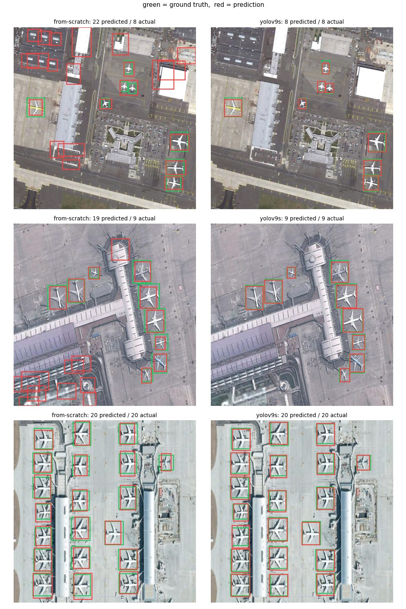

# Aircraft Detection in Satellite Imagery

[](https://colab.research.google.com/github/Abdalrahman-git/aircraft-detection-yolo/blob/main/notebooks/aircraft_detection.ipynb)

Detecting aircraft in very-high-resolution overhead imagery, on the aircraft
class of NWPU VHR-10 — built two ways and measured against each other:

1. **A detector written from scratch in PyTorch** — no `ultralytics`, no
   pretrained weights, no detection framework. CSP backbone, SPPF neck, focal +
   CIoU loss, NMS and average precision all implemented directly.
2. **A fine-tuned YOLOv9-S**, from COCO-pretrained weights.

Both are scored by the *same* metric code on the *same* seeded split, so the
table below is a measurement rather than two numbers from two libraries.



*Held-out test images. Green is ground truth, red is the model. Left: the
from-scratch detector. Right: fine-tuned YOLOv9-S.*

---

## Results

Held-out test split: **14 images, 120 aircraft**, used exactly once. Each model
is read at the confidence threshold it earned on validation.

| Metric | from-scratch | YOLOv9-S (fine-tuned) |
|---|---|---|
| **AP@0.5** | 0.875 | **1.000** |
| **AP@0.5:0.95** | 0.355 | **0.733** |
| Precision | 0.547 | 0.976 |
| Recall | 0.967 | 1.000 |
| F1 | 0.699 | 0.988 |
| Parameters | 1,128,933 | 7,167,475 |
| Pretrained | no | COCO |

Both models find nearly every aircraft — the gap is false positives. The
from-scratch model fires on hangars and storage tanks, costing it precision. The
wider gap is **AP@0.5:0.95**, which rewards tight localisation: a single-scale
20×20 grid predicting one box per cell is structurally outmatched by a
multi-scale anchor-based head. Most of the rest is the pretrained backbone — on
62 training images, COCO initialisation outweighs any design choice on either
side.

*The test split is 14 images. These numbers are real on it, but too small a
sample to read as a general claim.* Raw output:
[`docs/results/`](docs/results/).

---

## The problem

| | |
|---|---|
| **Tiny objects** | median aircraft ≈ 7% × 11% of the image (~46 × 72 px at 640) |
| **Dense scenes** | 8.4 per image, up to 31, often wingtip to wingtip |
| **Tiny dataset** | 90 of 650 annotated images contain aircraft — the entire signal |
| **Class imbalance** | 400 grid cells per image, ~8 positive |

## Approach

`stem → 4× CSP → SPPF → 1×1 head`, stride 32, so 640 px yields a 20×20 grid;
each cell predicts `(tx, ty, w, h, objectness)`. Focal loss handles the
background imbalance, CIoU keeps a gradient where plain IoU is flat, and
augmentation uses the full dihedral group — overhead imagery has no canonical
"up".

Evaluation scores predictions against the **raw** ground truth rather than the
grid-encoded target, so the one-box-per-cell encoding cannot hide a missed
object; and each model's operating point is tuned on validation, never on test.

## Three things that only showed up by running it

- **A 6×6 stride-2 convolution padded by `k // 2` emits `in/2 + 1` rows.** 640 px
  produced a 21×21 grid while the decoder assumed exact tiling — every box off by
  a fraction of a cell. Caught by a unit test comparing `grid_size()` against a
  real forward pass.
- **Ultralytics' `optimizer="auto"` destroys the model here.** It picks AdamW at
  `lr0=0.002`; validation mAP@0.5 peaks at 0.937 *inside warmup*, then collapses
  to 0.002 and never recovers. Pinned to `3e-4` with cosine decay.
- **An untuned confidence threshold nearly tripled the reported score** — same
  weights, same images, F1 0.27 → 0.70.

The reasoning behind each design decision is in the notebook, next to the code
it describes.

---

## Repository

```
notebooks/aircraft_detection.ipynb   the project end to end, with outputs
src/aircraft_detector/               the implementation the notebook imports
tests/                               95 tests, no network or dataset needed
docs/                                figures and raw results
```

The notebook is the narrative; the package is the implementation. It imports
rather than restates, so there is one version of every function and it is the
one the tests cover. `python notebooks/build_notebook.py` regenerates it, and CI
fails if the committed notebook has drifted from that script.

## Dataset

NWPU VHR-10 is distributed by Northwestern Polytechnical University **for
research purposes only** and is not redistributed here. The authors ask that you
cite:

> Gong Cheng, Junwei Han, Peicheng Zhou, Lei Guo. *Multi-class geospatial object
> detection and geographic image classification based on collection of part
> detectors.* ISPRS J. Photogramm. Remote Sens., 98: 119–132, 2014.

> Gong Cheng, Junwei Han. *A survey on object detection in optical remote sensing
> images.* ISPRS J. Photogramm. Remote Sens., 117: 11–28, 2016.

> Gong Cheng, Peicheng Zhou, Junwei Han. *Learning rotation-invariant
> convolutional neural networks for object detection in VHR optical remote
> sensing images.* IEEE TGRS, 54(12): 7405–7415, 2016.

Architectural ideas (CSP, SPPF, SiLU, focal loss on background) follow the
YOLOv5 line of work; the implementation here is independent.

## Licence

MIT — see [LICENSE](LICENSE). Covers the code only, not the dataset.
