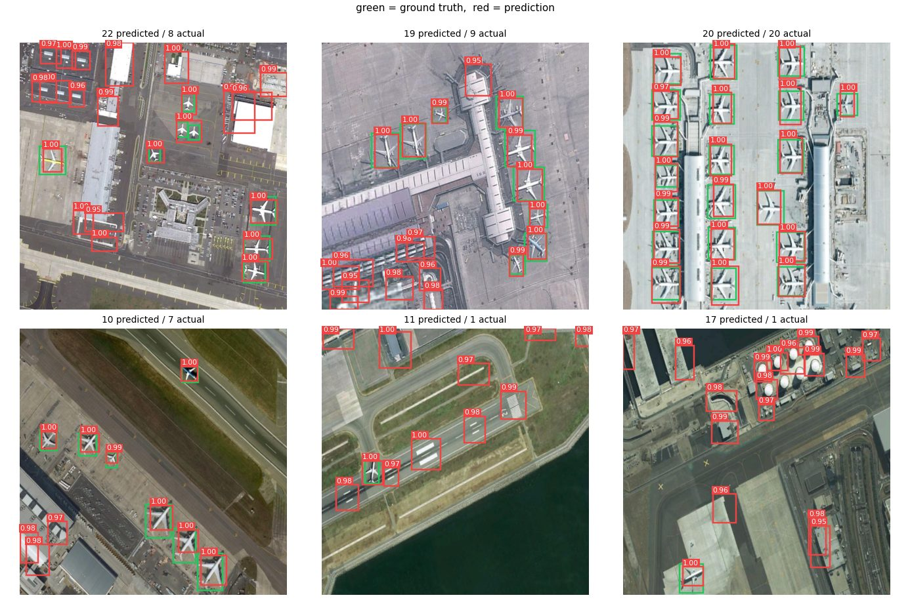
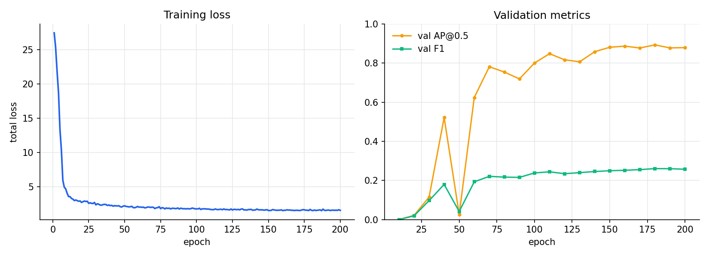

# Aircraft Detection in Satellite Imagery

[](https://colab.research.google.com/github/Abdalrahman-git/aircraft-detection-yolo/blob/main/notebooks/aircraft_detection_demo.ipynb)

Single-class aircraft detection in overhead remote sensing imagery, on the
aircraft class of NWPU VHR-10.

The repository holds **two models and one evaluation harness**:

1. **A detector written from scratch in PyTorch** — no `ultralytics`, no
   pretrained weights, no detection framework. CSP backbone, SPPF neck, focal +
   CIoU loss, NMS and average precision are all implemented here.
2. **A fine-tuned YOLOv9-S** — the production answer, starting from COCO
   pretrained weights.

Both are scored by the *same* metric code on the *same* seeded split, so the
comparison below is a measurement rather than two numbers from two frameworks
that happen to share a vocabulary. Writing the baseline is how you learn what a
detection framework actually does; benchmarking it against one is how you find
out whether your version is any good.


*Held-out test images. Green is ground truth, red is the model. Left: the
from-scratch detector. Right: fine-tuned YOLOv9-S.*

---

## Why this problem is harder than it looks

| | |
|---|---|
| **Tiny objects** | The median aircraft occupies 7% × 11% of the image — roughly 46 × 72 px at the 640 px working resolution. |
| **Dense scenes** | 8.4 aircraft per image on average, up to 31 in a single frame, often parked wingtip to wingtip. |
| **Tiny dataset** | Only 90 of the 650 annotated NWPU images contain aircraft. That is the entire training signal. |
| **Extreme class imbalance** | 400 grid cells per image, ~8 of them positive. Over 97% of every training example is background. |

The dataset size is the binding constraint, and it drives most of the design
decisions below: aggressive label-preserving augmentation, a deliberately small
(1.1 M parameter) model, and a held-out test split that is never augmented and
never used for checkpoint selection.

---

## Results

Held-out test split: **14 images, 120 aircraft**, used exactly once. Both models
scored by the same code, at a confidence threshold each selected on validation.

| Metric | from-scratch | YOLOv9-S (fine-tuned) |
|---|---|---|
| **AP@0.5** | 0.875 | **1.000** |
| **AP@0.5:0.95** | 0.355 | **0.733** |
| Precision | 0.547 | 0.976 |
| Recall | 0.967 | 1.000 |
| F1 | 0.699 | 0.988 |
| Parameters | 1,128,933 | 7,167,475 |
| Confidence threshold | 0.95 | 0.30 |
| Pretrained | no | COCO |

**Read the gap carefully.** Both models find nearly every aircraft — recall 0.967
against 1.000. The difference is almost entirely *false positives*: the
from-scratch model fires on hangars, terminal buildings and storage tanks, which
is what drops its precision to 0.547. In the comparison at the top of this page
it predicts 22 boxes for 8 aircraft, while YOLOv9 predicts exactly 8.



*The from-scratch model alone, at its tuned threshold of 0.95. It is close to
perfect on the dense apron scene (20 predicted, 20 actual) and over-fires on the
sparse ones — the failure mode a 62-image training set produces.*

The wider gap is **AP@0.5:0.95, 0.355 against 0.733**. That metric rewards tight
localisation, and it is where a single-scale 20×20 grid regressing one box per
cell is structurally outmatched by a multi-scale anchor-based head. Finding the
aircraft is the easy half; putting the box exactly on it is the half that needs
the architecture.

Most of the remaining difference is the pretrained backbone rather than the
architecture. On 62 training images, COCO initialisation is worth more than any
design choice available on either side.

**On that AP@0.5 of 1.000:** it means every one of YOLOv9's detections ranked
above every false positive across those 14 images. That is a real result on this
split, but 14 images is a small sample and the figure should not be read as a
general claim — it would not survive contact with a larger or harder test set.



The from-scratch run is 200 epochs in 23.9 minutes on CPU. YOLOv9-S early-stopped
at epoch 57 of 80 (best at 37) in 40 minutes on the same CPU.

Splits are seeded, so both models see the same images on every run.

---

## Architecture

```
input 640x640x3
      |
      v
   stem            6x6 conv, stride 2, padding 2         -> 320x320x16
      |
      v
   CSP x4          each: 3x3 stride-2 downsample,        -> 20x20x256
                   split into conv path + shortcut,
                   concatenate, fuse
      |
      v
   SPPF            three chained 5x5 max-pools           -> 20x20x256
                   (receptive fields 5, 9, 13)
      |
      v
   head            1x1 conv -> 5 channels, sigmoid       -> 20x20x5
```

Total stride is 32, so a 640 px input yields a **20×20 grid**. Each cell predicts
one box: `(tx, ty, w, h, objectness)`, where `tx, ty` are offsets inside the cell
and `w, h` are normalised to the whole image.

**One box per cell is safe here, and I checked rather than assumed.** At 20×20,
all 757 aircraft in the dataset fall into distinct cells, so the encoding discards
nothing. `encode_target` returns a count of any boxes it had to drop, so this stays
verifiable if the resolution, grid or object class ever changes.

### Loss

```
L = 5*CIoU_loss  +  5*BCE(objectness | object)  +  0.5*Focal(objectness | background)
```

Objectness bias is initialised to −4.6 (sigmoid ≈ 0.01), so the model starts by
predicting "nothing anywhere" and learns to fire, rather than spending its first
epochs unlearning a uniform positive prior.

Focal loss on the background term is what keeps the imbalance manageable: it
down-weights the thousands of easy empty cells so the few genuinely ambiguous
ones still drive the gradient.

Box regression uses **CIoU** rather than plain IoU. Plain IoU is exactly zero for
any pair of non-overlapping boxes, so it produces no gradient in precisely the
situation that dominates early training. CIoU adds centre-distance and
aspect-ratio terms that stay informative when the boxes are still far apart.

### Augmentation

Overhead imagery has no canonical "up", so the full dihedral group — horizontal
flip, vertical flip, 90° rotation — is label-preserving. That is an 8× effective
expansion of a small training split for free, plus random zoom crops and
photometric jitter for sensor and seasonal variation.

Crops are taken as random sub-windows and resized back up, so no reflected or
padded border is ever introduced.

---

## The YOLOv9 comparison

YOLOv9 contributes two ideas: **GELAN**, a generalised ELAN/CSP backbone, and
**PGI**, an auxiliary reversible branch that supplies clean gradients during
training and is discarded at inference. It is anchor-free with a decoupled head,
a task-aligned assigner and distribution focal loss.

**It is fine-tuned here, not trained from scratch, and that is a deliberate
choice.** This dataset has 62 training images. YOLOv9-S is roughly 7 M parameters
against the baseline's 1.1 M, and PGI's benefit appears on deep networks with
real data volume. From random initialisation on 62 images it would lose to the
much smaller baseline. From COCO-pretrained weights the backbone already encodes
generic edge and shape structure — precisely what 62 images cannot teach it.
Reporting a from-scratch YOLOv9 number here would be a statement about the
dataset size, not about YOLOv9.

### The default learning rate destroys the model

Worth recording, because it is invisible unless you watch validation during the
run. Ultralytics' `optimizer="auto"` inspects the dataset and selects AdamW at
`lr0=0.002`. On this dataset that setting does not underfit or overfit — it
erases the pretrained weights outright:

| epoch | 2 | 3 | 4 | 5 | 6 | 14 |
|---|---|---|---|---|---|---|
| val mAP@0.5 | **0.937** | 0.023 | 0.833 | 0.090 | 0.000 | 0.002 |

The peak at epoch 2 is the model still inside its 3-epoch warmup, where the
effective rate is a fraction of `lr0`. The moment the full rate applies, the
COCO features are overwritten by gradients from 62 images, and it never recovers
— this is catastrophic forgetting, not slow convergence, so more epochs do not
help.

`auto` is not wrong, it is just calibrated for datasets orders of magnitude
larger. Fine-tuning on a small dataset needs a rate that *adapts* pretrained
features rather than rewriting them, so this project pins AdamW at
`lr0=3e-4` with cosine decay. The lesson generalises past this repo: a framework
default that is sensible at COCO scale can be actively destructive at 62 images,
and only per-epoch validation makes that visible.

### Making the comparison fair

Three things are enforced in [`benchmark.py`](src/aircraft_detector/benchmark.py)
rather than assumed:

**The same images.** `yolov9/export.py` materialises the Ultralytics directory
layout *from* `build_splits` — the same seeded filename shuffle the baseline
uses. Left to itself Ultralytics would invent its own split, and a model
evaluated on a different 14 images is not comparable. A unit test asserts the
exported splits match the baseline's exactly.

**The same metric code.** Ultralytics' `mAP50` and this project's `ap50` do not
mean quite the same thing — they differ in interpolation, NMS defaults and
matching rules. So neither framework's summary number is used. Both models are
reduced to `(boxes, scores, ground_truth)` and scored by the same
`score_detections`.

**The same coordinate space.** The baseline resizes each image to a square, and
normalised `(cx, cy, w, h)` is invariant under a pure resize — no crop, no
padding, so a box's fractional position does not move. Ultralytics letterboxes
instead but reports predictions in *original* pixel coordinates, which divide by
the original width and height into that same normalised frame. Each model keeps
its native preprocessing while both are measured in identical units.

---

## Evaluation methodology

Detection metrics are easy to accidentally inflate. Two choices here guard against that:

**Scoring against raw ground truth, not the encoded target.** Each sample returns
its unencoded boxes alongside the grid tensor, and metrics use those. Scoring
against the grid target would mean any object the encoding dropped simply stops
counting — silently raising recall.

**Separating the PR curve from the operating point.** Average precision sweeps the
full confidence range; precision, recall and F1 are reported at the threshold you
would actually deploy. Reporting only the latter makes two runs incomparable
whenever their confidence calibration differs.

Matching is greedy in descending score order at a given IoU, and each ground-truth
box can be claimed once — so duplicate detections of the same aircraft count as
false positives, which is what makes NMS quality visible in the score.

`--sweep` reports precision/recall/F1 across thresholds so the operating point is
chosen from validation data rather than guessed.

---

## Engineering notes

This started as a single 400 KB notebook. The rewrite fixed several substantive
problems, recorded here because the reasoning is the interesting part.

**A missing function made training impossible.** The training loop called
`evaluate_map(...)` every tenth epoch, but the function was never defined —
anywhere. Any run reaching epoch 10 died with a `NameError`. It is now implemented
properly in `metrics.py`, with average precision rather than a bare F1 score.

**The stem convolution was silently misaligned.** A 6×6 stride-2 convolution with
padding `k//2 = 3` emits `in/2 + 1` rows, not `in/2`. A 640 px input therefore
produced a **21×21** grid while the decoder's cell-to-image mapping assumed the
grid tiled the image exactly, so every predicted box was offset by a fraction of
a cell. Correct "same" padding for an even kernel is `(k − s)/2 = 2`. A unit test
comparing `grid_size()` against a real forward pass caught this.

**Box clipping halved objects near the frame edge.** Augmentation clamped widths
with `w = min(w, 1 - x, x)`, which treats a full width as if it were a half-width.
Any box within half its own width of an edge was silently shrunk. Clipping now
happens in corner space, and boxes retaining under 40% of their area are dropped
rather than distorted.

**Two schedulers were fighting over the learning rate.** A `LambdaLR` warmup and a
`CosineAnnealingLR` were both attached to the same optimizer and stepped
alternately. `LambdaLR` rescales `base_lr` while `CosineAnnealingLR` tracks its own
step count, so the post-warmup curve was neither of the two intended shapes. Both
are now a single schedule.

**Augmentation leaked into validation.** Train and validation shared one dataset
object whose `augment` flag was flipped inside `__getitem__` — not thread-safe,
and wrong under any `num_workers > 0`. Splits are now separate dataset instances,
and a test asserts validation samples are stable across reads.

**Nothing was reproducible.** No seeding anywhere, so the split itself changed on
every run and no two experiments were comparable. Seeding now covers Python,
NumPy, torch and the dataloader workers; splits are derived from a seeded shuffle
of filenames.

**There was no test set.** Model selection and final reporting both used the same
validation split, so the headline number was optimistically biased. There are now
three splits, and the reported figure comes from a test set used exactly once.

**The confidence threshold was a guess, and it mattered enormously.** The
original hard-coded 0.65, then 0.50, with no justification. At the config default
of 0.35 the trained baseline scores 117 true positives against **627 false
positives** — F1 0.27. Tuned on validation instead, the same weights and the same
test images give F1 0.70. Nothing about the model changed; the reported number
nearly tripled. That is why `evaluate --sweep` exists and why the benchmark
selects each model's operating point on validation.

Also: `cv2` was dropped in favour of Pillow (one less heavy dependency, and it
removes the BGR/RGB conversion dance), decoding was vectorised out of a Python
double loop over grid cells, the three divergent IoU implementations were merged
into one, hardcoded `/content/` Colab paths became configuration, and the notebook
shrank from 394 KB to 10 KB by being generated from a script and committed without
outputs.

---

## Project structure

```
src/aircraft_detector/
├── config.py            typed config, YAML + CLI overrides
├── boxes.py             box conversions, IoU, CIoU, NMS
├── losses.py            focal objectness + CIoU box loss
├── metrics.py           greedy matching, average precision, P/R/F1
├── postprocess.py       vectorised grid decode + NMS
├── train.py             training loop, warmup -> cosine schedule
├── evaluate.py          checkpoint scoring, confidence sweep
├── predict.py           inference on new imagery
├── report.py            README figures
├── benchmark.py         both models, one metric harness
├── utils.py             seeding, device selection
├── data/
│   ├── prepare.py       NWPU VHR-10 -> YOLO labels
│   └── dataset.py       dataset, augmentation, deterministic splits
├── models/
│   └── yolo_tiny.py     ConvBNSiLU, CSPBlock, SPPF, YOLOTiny
└── yolov9/              optional track, lazily imports ultralytics
    ├── export.py        our seeded splits -> Ultralytics layout
    ├── train.py         YOLOv9-S fine-tuning
    └── adapter.py       Ultralytics output -> our detection format
```

---

## Tests

82 tests run against the detector, the metrics and the data pipeline. Fixtures
are generated on the fly, so the suite needs no network, no dataset and no
`ultralytics` install.

They cover box geometry and IoU/CIoU, NMS suppression and ordering, annotation
parsing, box clipping, grid encoding, split determinism and disjointness, model
output shapes, loss finiteness and differentiability, and the average-precision
implementation against hand-computed values.

Two of them caught real defects, both covered in the engineering notes above:
the grid-size test found a misaligned stem convolution, and the split test found
augmentation leaking into validation. Every push runs the suite and `ruff`
against Python 3.10 and 3.12.

---

## Dataset and citations

NWPU VHR-10 is distributed by Northwestern Polytechnical University **for research
purposes only** and is not redistributed in this repository. The dataset authors
ask that you cite:

> Gong Cheng, Junwei Han, Peicheng Zhou, Lei Guo. *Multi-class geospatial object
> detection and geographic image classification based on collection of part
> detectors.* ISPRS Journal of Photogrammetry and Remote Sensing, 98: 119–132, 2014.

> Gong Cheng, Junwei Han. *A survey on object detection in optical remote sensing
> images.* ISPRS Journal of Photogrammetry and Remote Sensing, 117: 11–28, 2016.

> Gong Cheng, Peicheng Zhou, Junwei Han. *Learning rotation-invariant convolutional
> neural networks for object detection in VHR optical remote sensing images.*
> IEEE TGRS, 54(12): 7405–7415, 2016.

Architectural ideas (CSP, SPPF, SiLU, the focal-loss treatment of background)
follow the YOLOv5 line of work; the implementation here is independent.

---

## Licence

MIT — see [LICENSE](LICENSE). Covers the code only, not the dataset.
